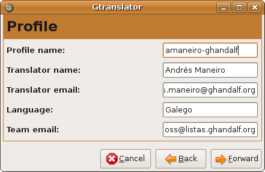
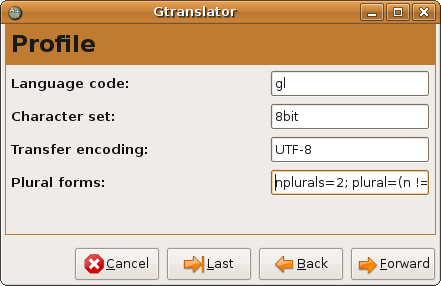
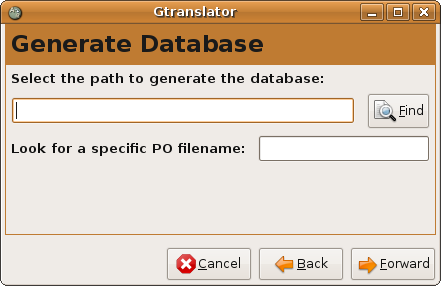
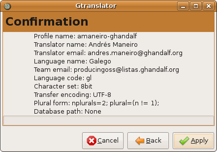

HowTo
=====

:Autor:     Andrés Maneiro
:E-mail:    andres.maneiro@ghandalf.org
:Copyright: Dominio Público
:Web:       http://producingoss.ghandalf.org

Cómo configurar un perfil de tradutor en gtranslator en 4 pasos para o
proxecto de tradución do libro Producing OSS, de Karl Fogel.

Translator options
------------------

Esta xanela sirve para configurar os datos que nos acreditarán como
tradutores nos arquivos traducidos. Elixe o correo e nome que consideres
máis adecuado, xa que éstes serán públicos.

* **Profile name**:      nome do perfil co que queiras gardar esta configuración
* **Translator name**:   o teu nome :)
* **Translator email**:  o teu mail :)
* **Language**:          Galician
* **Team email**:        producingoss@listas.ghandalf.org

Language options
----------------

Nesta xanela configuraremos os datos propios do idioma ó que imos a
traducir, neste caso o galego.

* **Language code**:     gl
* **Character set**:     UTF-8
* **Transfer encoding**: 8bit
* **Plural forms**:      nplurals=2;plural=(n != 1);

Generate Database
-----------------

Non é preciso cubrir estos campos.

Confirmation
------------

Éste é o paso final: únicamente confirma que todos os datos son
correctos.
